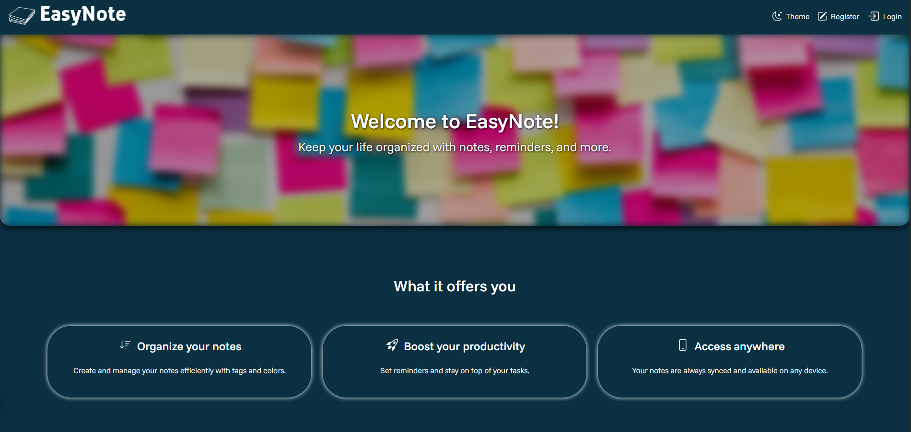
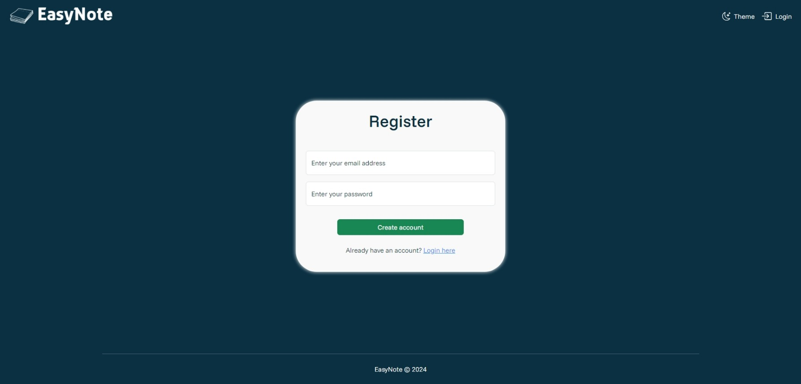
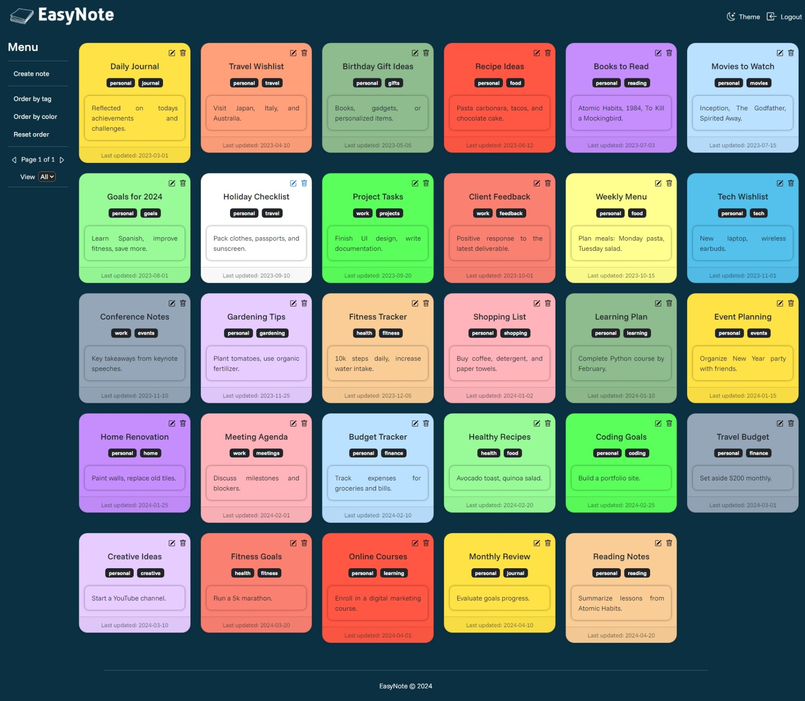

# EasyNote
This repository hosts the source code for EasyNote, an user-friendly note-taking application designed to help you manage your notes efficiently. 

EasyNote offers a clean and intuitive UI, making it simple for users to create, edit, and organize their notes.

# Content

- [How to use it](#how-to-use-it)

 

# How to use it

The application offers the user a login page in which it can authenticate if it already has an account, otherwise there is a register page in which it can create an account.

### **Login page**

### **Register page**

### **Home page**

After a successful authentication, the user will be redirected to the home page in which it can view, create, edit or delete notes.

#### **Create note**

The user can clic the option `Create note` from the menu on the sidebar to create a new note. When doing so, a title and content for the note are required. Also, if the user selects a color it will automatically change the popup background color to preview it.

#### **Edit note**

The user can clic the option 
<svg xmlns="http://www.w3.org/2000/svg" width="15" height="15" fill='currentColor' class="bi bi-pencil-square" viewBox="0 0 16 16">
    <path d="M15.502 1.94a.5.5 0 0 1 0 .706L14.459 3.69l-2-2L13.502.646a.5.5 0 0 1 .707 0l1.293 1.293zm-1.75 2.456-2-2L4.939 9.21a.5.5 0 0 0-.121.196l-.805 2.414a.25.25 0 0 0 .316.316l2.414-.805a.5.5 0 0 0 .196-.12l6.813-6.814z"/>
    <path fill-rule="evenodd" d="M1 13.5A1.5 1.5 0 0 0 2.5 15h11a1.5 1.5 0 0 0 1.5-1.5v-6a.5.5 0 0 0-1 0v6a.5.5 0 0 1-.5.5h-11a.5.5 0 0 1-.5-.5v-11a.5.5 0 0 1 .5-.5H9a.5.5 0 0 0 0-1H2.5A1.5 1.5 0 0 0 1 2.5z"/>
</svg> 
from the note itself to edit the note. When doing so, as same as before a title and content for the note are required and if the user selects a color it will automatically change the popup background color to preview it.

#### **Delete note**

The user can clic the option 
<svg xmlns="http://www.w3.org/2000/svg" width="15" height="15" fill='currentColor' class="bi bi-trash" viewBox="0 0 16 16">
    <path d="M5.5 5.5A.5.5 0 0 1 6 6v6a.5.5 0 0 1-1 0V6a.5.5 0 0 1 .5-.5m2.5 0a.5.5 0 0 1 .5.5v6a.5.5 0 0 1-1 0V6a.5.5 0 0 1 .5-.5m3 .5a.5.5 0 0 0-1 0v6a.5.5 0 0 0 1 0z"/>
    <path d="M14.5 3a1 1 0 0 1-1 1H13v9a2 2 0 0 1-2 2H5a2 2 0 0 1-2-2V4h-.5a1 1 0 0 1-1-1V2a1 1 0 0 1 1-1H6a1 1 0 0 1 1-1h2a1 1 0 0 1 1 1h3.5a1 1 0 0 1 1 1zM4.118 4 4 4.059V13a1 1 0 0 0 1 1h6a1 1 0 0 0 1-1V4.059L11.882 4zM2.5 3h11V2h-11z"/>
</svg>
from the note itself to delete the note. When doing so, a confirmation popup will open asking the user to confirm the note deletion. If the user confirms then the note will be deleted and it will no longer appears.

 

# To Do

- Add app description to readme
- Add app tutorial in ``Learn more`` button in main page
- Create functionality to add reminders
- Create functionality to add tasks
- Redesign grid in home page
